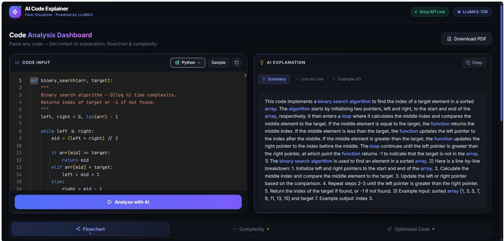

# AI Code Explainer & Flow Visualizer 🚀

A powerful full-stack application that leverages Artificial Intelligence to analyze code, generate flowcharts, and suggest optimizations. Built with **React** on the frontend and **Flask** on the backend, using the **Groq API** for lightning-fast LLM inference.



## ✨ Features

- **🔍 Smart Code Analysis**: Detailed summaries and line-by-line breakdowns of your code.
- **📊 Flowchart Generation**: Automatically generates Mermaid.js flowcharts to visualize logic flow.
- **⚡ Complexity Analysis**: Instant Time and Space complexity estimation (Big-O notation).
- **💡 Code Optimization**: Provides a refactored, optimized version of your code with explanations.
- **📄 PDF Export**: Download your code analysis, flowchart, and complexity reports as a well-formatted PDF.
- **📝 Multi-language Support**: Works with Python, JavaScript, C++, Java, and more.
- **🎨 Premium UI**: Modern, responsive design built with Tailwind CSS and Monaco Editor.

## 🛠️ Tech Stack

### Frontend
- **React 19** (Vite)
- **Tailwind CSS** (Styling)
- **Monaco Editor** (Code editing)
- **Mermaid.js** (Diagram rendering)
- **Lucide React** (Icons)
- **Axios** (API communication)

### Backend
- **Flask** (Python Web Framework)
- **Groq SDK** (LLM Inference - LLaMA 3.3 70B)
- **Python Dotenv** (Environment management)
- **Flask-CORS** (Handling Cross-Origin requests)

## 🚀 Getting Started

### Prerequisites
- Node.js (v18+)
- Python (v3.9+)
- A [Groq API Key](https://console.groq.com/keys)

### Backend Setup

1. Navigate to the backend directory:
   ```bash
   cd backend
   ```
2. Create a virtual environment and activate it:
   ```bash
   python -m venv venv
   # Windows:
   venv\Scripts\activate
   # macOS/Linux:
   source venv/bin/activate
   ```
3. Install dependencies:
   ```bash
   pip install -r requirements.txt
   ```
4. Create a `.env` file in the `backend` folder:
   ```env
   GROQ_API_KEY=your_groq_api_key_here
   ```
5. Run the Flask server:
   ```bash
   python app.py
   ```
   The backend will start at `http://localhost:5000`.

### Frontend Setup

1. Navigate to the frontend directory:
   ```bash
   cd frontend
   ```
2. Install dependencies:
   ```bash
   npm install
   ```
3. Start the development server:
   ```bash
   npm run dev
   ```
   The frontend will be available at `http://localhost:5173`.

## 📖 Usage

1. Open the application in your browser.
2. Paste your code into the code editor.
3. Select the programming language from the dropdown.
4. Click **"Analyze Code"**.
5. View the generated explanation, flowchart, complexity analysis, and optimized code in the results panel.


